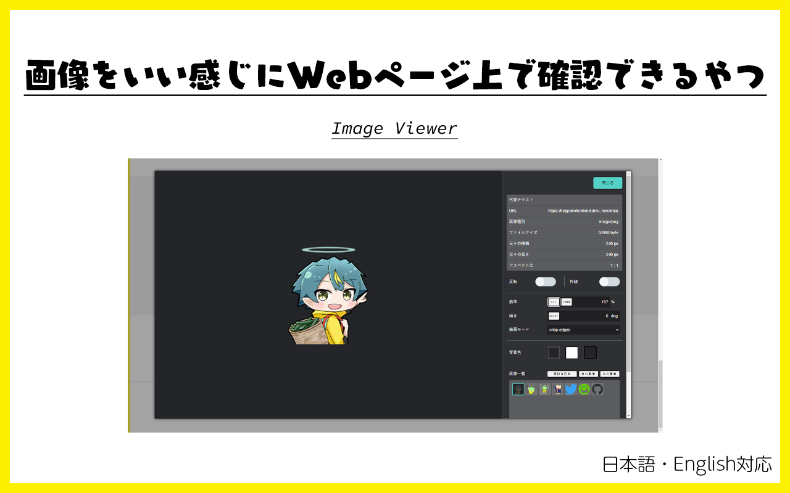

# 画像をいい感じに Web ページ上で確認できるやつ

 

[English version is here.](./README.md)

画像の上で開くコンテキストメニュー（右クリックメニュー）から、対象の画像が操作できるツールです。

## Download

Google Chrome にインストールしてください。

## How to use

1. Web ページ上の画像を右クリック（コンテキストメニューを開く）
2. Image Viewer を選ぶ
3. 任意のメニューをクリックする

### 💡「詳細を表示」機能について

詳細確認ダイアログでは、画像の元々の大きさやファイルサイズなどが確認できます。
また、次のような操作で簡単に画像を操作できます。

- `ドラッグ`：画像の移動
- `マウスホイール`：拡大・縮小
- `Shiftキー＋マウスホイール`：回転

#### 画像一覧

画像を選択したあと（選択中の項目にフォーカスがあるとき）は方向キーで操作できます。
